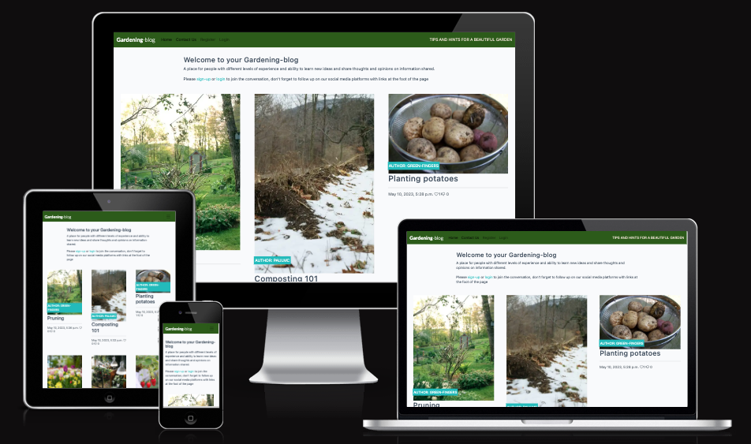
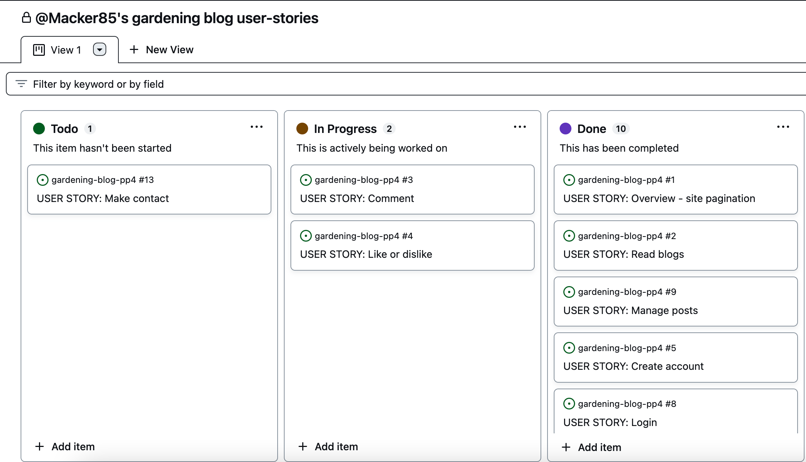
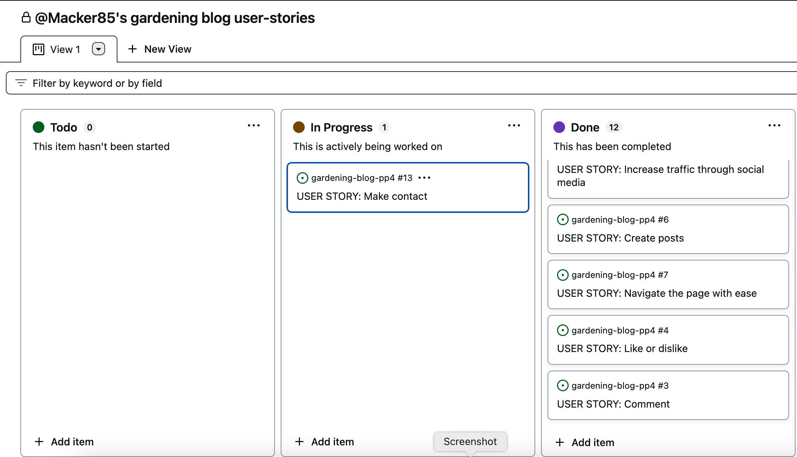
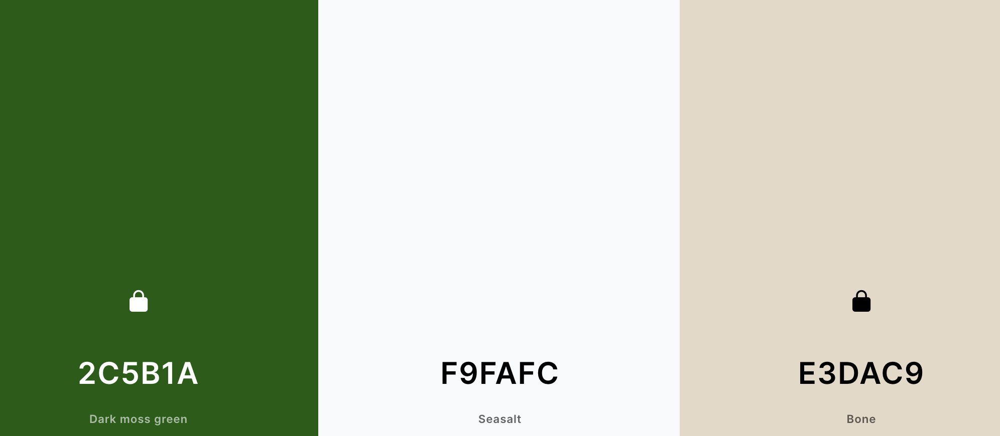

# Gardening Blog

**Developer: Paul McCormack**

[Visit live website](https://gardening-blog.herokuapp.com/)

## Table of Contents
  - [About](#about)
  - [User Goals](#user-goals)
  - [Site Owner Goals](#site-owner-goals)
  - [User Experience](#user-experience)
  - [User Stories](#user-stories)
  - [Design](#design)
    - [Colours](#colours)
    - [Fonts](#fonts)
    - [Structure](#structure)
      - [Website pages](#website-pages)
      - [Database](#database)
    - [Wireframes](#wireframes)
  - [Technologies Used](#technologies-used)
  - [Features](#features)
  - [Validation](#validation)
  - [Testing](#testing)
    - [Manual testing](#manual-testing)
    - [Automated testing](#automated-testing)
    - [Tests on various devices](#tests-on-various-devices)
    - [Browser compatibility](#browser-compatibility)
  - [Bugs](#bugs)
  - [Heroku Deployment](#heroku-deployment)
  - [Credits](#credits)
  - [Acknowledgements](#acknowledgements)

### About

This Gardening blog is a website built to give users a place to go to get tips for domestic gardening. I got the idea for this from tlking to people that live near me that had a building interest in their gardens. In particular a neighbour that had a specific interest who I treated as the client.

### User Goals

- To find information on gardening relevant to me.
- Create an account so I can engage with the community.
- To be able to give feedback on the information I am reading with likes or dislikes.
- To engage with the author through messaging.
- Find a social aspect through social media links.
- Get in touch with queries and questions about gardening.

### Site Owner Goals

- To give a platform to people looking to share ideas.
- To help people engage with eachother with dialogue and reactions.
- Ensure ease of use with pagination.
- Drive traffic to social media accounts.
- Get feedback that 

## User Experience

### User Requirements and Expectations

- Fully responsive with sign up and login ability.
- Easily accessible and navigated.
- A fresh and bright design.
- Social media availability.

##### Back to [top](#table-of-contents)

## User Stories

### Users

### Site Owner  

### Kanban
- GitHub Kanban was used to track all open user stories

User Stories

Kanban

##### Back to [top](#table-of-contents)

## Design

### Colours

I choose light bright colours to make the site look fresh with some earthy colours that spported the theme of gardening.

The colors I wanted to stay close to  [Coolors.co](https://coolors.co/)

See colour pallet

### Fonts

 The fonts selected were from Google Fonts, Roboto and Lato with sans-serif as a backup font. These were chosen as they are popular across alot of sites and will give a feeling of familiarity.

### Structure

#### Website pages

The site was designed to have this feeling of familiarity for the user with the navigation bar along the top of the pages and a hamburger menu button for smaller screen.

The footer contains all relevant social media links to increase popularity with usage and increase the traffic.

## Technologies Used

### Languages & Frameworks

- HTML
- CSS
- Javascript
- Python
- Django

### Libraries/Tools

- [Am I Responsive](http://ami.responsivedesign.is/)
- [Bootstrap v5](https://getbootstrap.com/)
- [Cloudinary](https://cloudinary.com/)
- [Favicon.io](https://favicon.io)
- [Font Awesome](https://fontawesome.com/)
- [Git](https://git-scm.com/)
- [GitHub](https://github.com/)
- [Google Fonts](https://fonts.google.com/)
- [Heroku Platform](https://id.heroku.com/login)
- [Postgres](https://www.postgresql.org/)
- [Summernote](https://summernote.org/)
- Validation:
  - [WC3 Validator](https://validator.w3.org/)
  - [Jigsaw W3 Validator](https://jigsaw.w3.org/css-validator/)
  - [JShint](https://jshint.com/)
  - [Pycodestyle(PEP8)](https://pypi.org/project/pycodestyle/)
  - [Lighthouse](https://developers.google.com/web/tools/lighthouse/)
  - [Wave Validator](https://wave.webaim.org/)

##### Back to [top](#table-of-contents)

### Device Testing & Browser compatibility

### Fork Repository
To fork the repository by following these steps:
1. Go to the GitHub repository listed at the beginning of this README file.
2. Click on Fork button in upper right hand corner.

### Clone Repository
You can clone the repository with the following steps:
1. Go to the GitHub repository.
2. Locate the Code button above the list of files and click it.
3. Select if you prefere to clone using HTTPS, SSH, or Github CLI and click the copy button to copy the URL to your clipboard.
4. Open Git Bash.
5. Change the current working directory to the one where you want the cloned directory.
6. Type git clone and paste the URL from the clipboard
7. Press Enter to create your local clone.

##### Back to [top](#table-of-contents)

## Credits

### Images

Images were all soursed from https://www.pexels.com/
Blog entries from https://awaytogarden.com/blog/

### Code

Code was worked along side the Code institute "I think therefore I blog" walkthrough and modified to suit.
I also took used https://github.com/ArronBeale/CI_PP4_the_diplomat for inspiration and reference.

##### Back to [top](#table-of-contents)

## Acknowledgements

### Special thanks to the following:
- Code Institute
- My wife Ciara
- My mentor Jack